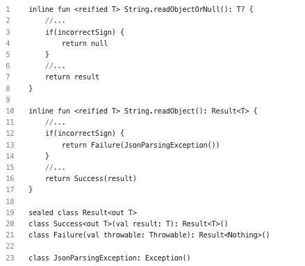

# 1.안전성
- 코틀린을 많이 활용하는 이유는 안전성
    - 크래시가 적으면 사용자와 개발자 모두에게 좋고, 상당한 비즈니스 가치를 제공
- 해당 장은 코틀린을 안전하게 사용하는 방법에 대해 설명

## Item1: 가변성을 제한하라
- var나 mutable 객체를 사용하면 상태를 가질 수 있음
- 아래 코드는 다음과 같은 문제점을 가질 수 있음\
\

  - 프로그램 이해하고 디버그하기 힘들어짐
    - 상태를 갖는 부분들의 관계를 이해해야 하며, 상태 변경이 많아지면 이를 추적하는 것이 힘듬
  - 가변성이 있으면, 코드의 실행을 추론하기 어려움
  - 멀티스레드 프로그램이

## Item2: 변수의 스코프를 최소화하라
- 

## Item3: 최대한 플랫폼 타입을 사용하지 말라

## Item4: inferred 타입으로 리턴하지 말라
- 타입 추론을 사용할 때는 몇 가지 위험한 부분들이 있음
  - 슈퍼터클래스 또는 인터페이스로 타입추론이 설정되지 않음\

- 이러한 위험한 부분을 피하려면 오른쪽에 피연산자에 맞게 걸졍해야함\
  
- 직접 라이브러리를 조작할 수 없는 경우에는 위와 같은 문제가 재발됨
  - 아래와 같은 API 인터페이스가 존재 \

  - 아래와 같이 리턴값을 명확하지 않게 기본값을 정해서 대입하면 구체 클래스만 활용할 수 밖에 없는 제한적 조건이 부여됨\

- 외부 API를 만들 때는 반드시 타입을 지정하고 만들자

## Item5: 예외를 활용해 코드에 제한을 걸어라
- 코틀린에서 코드의 동작에 제한을 거는 방법
  - require 블록: 아규먼트를 제한할 수 있음
  - check 블록: 상태와 관련된 동작을 제할할 수 있음
  - assert 블록: 어떤 것이 true인지 확인할 수 있음, 테스트 모드에서만 작동
  - return 또는 throw와 함께 활용하는 elvis 연산자
- 제한을 걸면 다양한 장점 발생
  - 문서를 읽지 않은 개발자도 문제를 확인 가능
  - 문제가 있을 경우 함수가 예상하지 못한 동작을 하지 않고 예외를 throw -> 예상하지 못한 동작이 더 위험
  - 코드가 어느 정도 자체적으로 검사됨
  - 스마트 캐스트 기능을 활용할 수 있게 되므로,캐스트(타입 변환)을 적게할 수 있음
  - 
##### 아규먼트
- 함수를 정의할 때 타입 시스템을 활용해서 아규먼트 제한을 거는 코드를 많이 사용
- 일반적으로 이러한 제한을 걸 때는 require 함수를 사용
  - 제한을 확인하고, 제한을 만족하지 못할 경우 예외를 throw
- 유효성 검사 코드는 함수의 가장 앞부분에 배치되므로, 읽는 사람도 쉽게 확인 가능
  - 모두가 코드를 읽는건 아니니, 문서에 해당 내용 반드시 명시
- require 함수는 만족 못할때, 무조껀 IllegalArgumentException 발생\

##### 상태
- 상태와 관련된 제한을 걸때는 일반적으로 check 함수를 사용\

- require과 유사하지만, IllegalStateException을 throw함
- 상태가 올바른지 확인할 때 사용 -> 보통 require 뒤에 배치함
  - 사용자가 규약을 어기고, 사용하면 안 되는 곳에서 함수를 호출하고 있다고 의심될 때 함
- 사용자가 제대로 사용할 거라고 믿는 것보다 문제상황을 예측하고 예외를 던지는게 좋음

##### Assert 계열 함수 사용
- 테스트에만 확인할 수 있는 assert이기에, production 환경에서는 발생하지 않음
- 다음과 같음 이점이 있음
  - 코드를 자체 점검하여, 효율적인 테스트 가능
  - 특정 상황이 아닌 모든 상황에 대한 테스트 가능
  - 실제 코드가 더 빠른 시점에 실패하게 만듬
- 표준 애플리케이션 실행에서는 assert가 예외를 throw 하지 않음

##### nullability와 스마트 캐스팅
- require을 활용하였을때 통과하는 property가 대변되는 변수로 스마트캐스팅 됨\

- null 체크와 같은 경우 requireNotNull, checkNotNull도 스마트 캐스트를 지원하기에 변수를 unpack 하는 용도로 활용 가능\

- elvis 연산자를 활용하기도 함
  - 가독성이 좋고 유연하게 사용할 수 있음

## Item6: 사용자 정의 오류보다는 표준 오류를 사용하라
- 아래와 같이 사용자 정의 오류를 사용함, 사용자 정의 오류보다는 표준 오류를 사용하는 것을 권장\

  - 다른 개발자들이 더 잘 이해하고, 재사용이 가능함
- 아래와 같이 일반적으로 사용되는 몇가지 예외 존재\
\

## Item7: 결과 부족이 발생하는 경우 null과 Failure를 사용하라
- 함수가 원하는 결과를 만들어 낼 수 없을 때가 존재
  - 서버로부터 데이터 읽는 중, 인터넷 연결 문제 발생
  - 조건에 맞는 첫 번째 요소를 찾으려 했는데, 조건에 맞는 요소가 없는 경우
- 이러한 상황에 처리하는 메커니즘은 크게 다음과 같이 두가지 존재
  - null 또는 '실패를 나타내는 seald 클래스(일반적으로 Failure라는 이름)'를 리턴
  - 예외를 throw 함
- 예외는 정보를 전달하는 방법으로 사용해서는 안됨, 특별한 상황을 나타내야함
  - 예외가 전파되는 과정을 제대로 추적하기 힘듬
  - 코틀린의 모든 예외는 unchecked 예외 -> 정확히 파악하기 힘듬
  - 예외적인 상황을 처리하기 위해서 만들어졌으며, 명시적인 테스트만큼 빠르게 동작하지 않음 (?)음 왜 빠르게 동작 안한다는거지...
  - try-catch 블록 내부에 코드를 배치하면, 컴파일러가 할 수 있는 최적화가 제한됨
- null과 Failure는 예상되는 오류를 표현할 때 굉장히 좋음 -> 명시적이며 효율적임
  - 이러면 예외를 놓치기 어려움\

- 예측할 수 있는 범위의 오류는 null과 Failure 사용, 예측 어려운 예외는 throw 활용
  - 추가적인 정보를 사용할 때 sealed result 클래스, 그렇지 않으면 null
  - Failure는 처리할 때, 필요한 정보를 가짐

## Item8: 적절하게 null을 처리하라
- null은 '값이 부족하다'는 것을 나타냄 -> 값이 설정되지 않았거나, 제거되었다는 것을 의미
- null은 최대한 명확한 의미를 갖는 것이 좋음 -> API를 사용하는 개발자들이 이해가 필요
- nullable 타입은 세가지 방법으로 처리
  - ?., 스마트 캐스팅, Elvis 연산자 등을 활용해서 안전하게 처리
  - 오류를 throw함
  - 함수 또는 프로퍼티를 리팩터링해서 nullable 타입이 나오지 않게 바꿈

##### null을 안전하게 처리하기
- 안전 호출하는 방법
  - 안전 호출(safe call)
  - 스마트 캐스팅(smart casting)
  - Elvis 연산자 -> return 또는 throw도 허용 가능\
\

##### 오류 throw하기
- 개발자가 예상 했던 상황이 발생하지 않고 그냥 넘어가면 이상하게 생각함
- 다른 개발자가 어떤 코드를 보고 선입견처럼 '당연히 그럴 것이다'라고 생각하게 되는 부분이 있고, 그 부분에서 문제가 발생할 경우 오류 강제로 발생시켜주는 걸 권장

##### not-null assertion(!!)과 관련된 문제
- !!는 활용하면 굉장히 편하다고 느낄수 있지만, NPE를 발생시킬 확률이 높음
- 현재 리턴 받는 값이 명확하게 null이 아니라고는 하지만 미래에는 어떻게 될지 모름
- 또한 !!을 사용하므로써 리턴을 주는 API의 nullable을 제한시킬수도 있음
- !!가 의미있게 사용하는건 굉장히 드뭄 -> nullability가 제대로 표현되지 않은 라이브러리를 사용할 때 정도만 의미
- 쓰지 않는게 좋음 -> 어떠한 조직은 아예 금지를 시킴

##### 의미 없는 nullability 피하기
- nullability는 어떻게든 적절하게 처리해야하는 추가 비용이듬
- 그러기에 꼭 필요한 경우가 아니면 nullability 자체를 피하는게 좋음
- nullability를 피할 때 사용할 수 있는 몇가지 방법 존재
  - 클래스에서 nullability에 따라 여러 함수를 만들어서 제공 가능
    - List<T>의 get과 getOrNull 함수 존재
  - 클래스 생성 이후에 확실하게 설정이 보장되면, lateinit 프로퍼티와 notNull 델리게이트 사용
  - 빈 컬렉션 대신 null을 리턴하지 금지
    - null 리턴: 컬렉션 자체가 없다는 것
    - 빈컬렉션: 요소가 부족하다는 것
  - nullable enum과 None enum 값은 완전 다른 의미

##### lateinit 프로퍼티와 notNull 델리게이트
- 클래스 생성 중에 초기화할 수 없는 프로퍼티를 가지는 것은 드문일이지만 분명 존재
- null을 활용하면 지속적인 unpack 처리를 해줘야하는 번거로움이 존재\

- lateinit을 활용하면 위와 같은 문제 해결 가능 -> 초기화 전에 사용하려고 하면 에러나 발생함\

- lateinit에는 다음과 같은 장점 존재
  - !!연산자로 unpack을 하지 안핟도 됨
  - null을 사용하고 싶을 때, nullable로 만들수 있음
  - 프로퍼티가 초기화된 이후에는 초기화 되지 않은 상태로 돌아갈 수 없음
- 반대로 lateinit은 Int,Long, Double, Boolean과 같은 기본 타입과 연결된 타입에는 활용하지 못함
  - delegates.notnull 사용(아이템 21에서 설명)\

## Item9: use를 사용하여 리소스를 닫아라
- 더이상 필요하지 않을 때, close 메서드를 사용하여 명시적으로 닫아야 하는 리소스 존재\

- 모든 리소스는 레퍼런스가 없어질 때, 가비지 컬렉션 처리 -> 레퍼런스 유지 시, 유지 비용 많이 들어감
- 기존 close를 명시해 주지만, 예외 발생에 대한 고려로 인해 가독성 저하를 시키면서 까지 close 시킴\

- use를 활용하면 모든 closeable 객체에 사용 가능\

- 아래처럼 한줄 씨 처리할 수 있는 함수도 존재\

- use를 사용하면 closeable/AutoCloseable을 구현한 객체를 쉽고 안전하게 처리 가능
- 파일을 처리할 때는 파일을 한 줄씩 읽어 들이는 useLines를 사용하는 것이 좋음

## Item10: 단위 테스트를 만들어라
- 코드를 안전하게 만드는 가장 궁국적인 방법은 다양한 종류의 테스트를 하는 것
- 다양한 종류의 테스트는 사용자의 관점에서 애플리케이션 외부적으로 제대로 작동하는지 확인 하는 것이 목표
  - 개발자의 관섬에서 내부적으로 올바르게 동작하는지 확인하는 것이 아님
- 이러한 다양한 테스트도 중요하지만 해당 요소가 올바르게 작동한다는 것을 완전하게 보증할 수 없기에 단위테스트가 필요
- 단위 테스트는 다음과 같은 내용을 확인
  - 일반적인 유스케이스: 요소가 사용 될거라고 예상되는 일반적인 방법을 테스트
  - 오류케이스와 잠재적인 문제: 제대로 동작되지 않을거라 예쌍되는 일반적인 부분
  - 에지 케이스와 잘못된 아규먼트: Int의 경우 Int.MAX_VALUE를 사용하는 경우 등
- 단위 테스트가 계속 축적되면 회귀 테스트도 가능
- 단위 테스트의 장점
  - 테스트가 잘 된 요소는 신뢰 가능
  - 리팩토링하는 것이 두렵지 않음 -> 이전 테스트 이상 없음으로 호환성 확인
  - 수동 보단 자동의 단위테스트가 빠름
- 단위 테스트의 단점
  - 단위 테스트를 만드는 데 시간이 걸림
  - 테스트를 활용할 수 있게 코드를 조정해야함
  - 좋은 단위 테스트를 만드는 작업이 꽤 어려움
- 숙련된 개발자는 단위 테스트와 관련된 기술을 습득하고, 중요한 코드라고 할 수 있는 다음과 같은 부분에 대해 테스트 할 수 있어야 함
  - 복잡한 부분
  - 계속해서 수정이 일어나고 리팩터링이 일어날 수 있는 부분
  - 비즈니스 로직 부분
  - 공용 API 부분
  - 문제가 자주 발생할 수 있는 부분
  - 수정해야 하는 프로덕션 버그