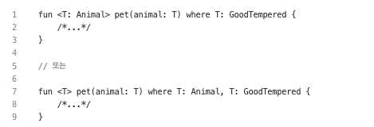
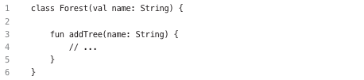
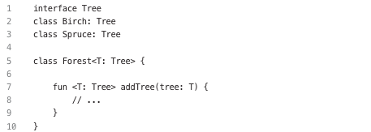
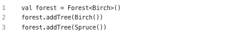
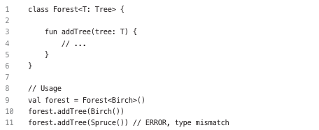
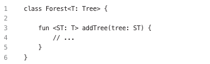

# 3. 재사용성
- 자세한 구현 부분을 몰라도 누군가가 한 번 만들어 놓으면, 필요할 때 이를 활용할 수 있는 것
- 사용에 대한 의존성이 많이 생기면 자유로운 수정이 힘들어짐 -> 재사용성 고려는 생각보다 어렵고 다양한 오류 야기
- 어떠한 답이 있는 것이 아니라, 수많은 개발자가 개발하는 과정에서 만들어진 방법들

## Item19: knowledge를 반복하여 사용하지 말라
- '프로젝트에서 이미 있던 코드를 복사해서 붙여넣고 있다면, 무언가가 잘못된 것이다'

##### knowledge
- 프로그래밍에서 knowledge는 넓은 의미로 '의도적인 정보'를 뜻함 -> 코드로 표현 가능
  - 상속을 하는데도 불구하고 특정 메소드는 오버라이드 하지 않게 강제하는 것 -> 의도가 존재
- 크게 2가지로 뽑을 수 있음
  - 로직: 프로그램이 어떤 식으로 동작하는지와 어떻게 보이는지
  - 공통 알고리즘: 원하는 동작을 하기 위한 알고리즘
- 둘의 차이점은 시간에 따른 변화
  - 로직: 시간에 따라 변화
  - 공통 알고리즘: 크게 변화가 없음 -> 최적화 또는 다른 알고리즘 교체는 되지만 동작 변화는 없음

##### 모든 것은 변화한다
- 애플리케이션, 언어 및 라이브러리 등 많은 것이 시간에 따라 변화됨
- knowledge가 계속 변화 하는 이유
  - 회사가 사용자의 요구 또는 습관을 더 많이 알게됨
  - 디자인 표준의 변화
  - 플랫폼, 라이브러리, 도구 등이 변화해서 이에 대응
- 변화할 때 가장 큰 적은 knowledge가 반복되어 있는 부분
  - knowledge에 대한 부분이 전체적으로 퍼져있으면 추후 변화 때, 변경이 매우 힘듬
  - knowledge 반복은 프로젝트의 확장성을 막고 쉽게 깨지게 만듬

##### 언제 코드를 반복해도 될까?
- knowledge 반복처럼 보이지만, 실질적으로 다른 knowledge를 나타내는 부분
- "함께 변경될 가능성이 높은가? 따로 변경될 가능성이 높은가"
  - 두 코드가 같은 knowledge를 나타내는지, 다른 knowledge를 나타내는지의 질문
- 코드를 추출하는 이유는 변경을 쉽게 만들기 위함
- 비즈니스 규칙이 다른 곳에서 왔는지 확인하는 방법 -> 단일 책임 원칙
  - 다른 곳에서 왔으면 독립적으로 변경될 가능성이 높음

##### 단일 책임 원칙
- 코드를 추출해도 되는지를 확인할 수 있는 원칙 -> 클래스를 변경하는 이유는 단 한가지여야 한다
- '두 액터가 같은 클래스를 변경하는 일은 없어야 함'
  - 액터는 변화를 만들어 내는 존재를 의미
  - 액터는 소로의 업무와 분야에 대해 잘 모르는 개발자들로 비유 -> 이러한 개발자들이 같은 코드를 변경하는 것은 매우 위험
- 단일책임 원칙을 활용한 예시에서 해결방법
  - 두 부서에서 모두 사용하는 일반적인 public 함수로 헬퍼 함수를 만듬 -> 함부러 변경하면 안된다는 것을 규정
  - 헬퍼 함수를 각각의 부서 모듈에 따라 2개 만듬
- 단일 책임 원칙은 두가지 사실을 알려줌
  - 서로 다른 곳에서 사용하는 knowledge는 독립적으로 변경할 가능성이 많음 -> 비슷한 처리를 하더라도, 완전히 다른 knowledge로 취급하는 것이 좋음
  - 다른 knowledge는 분리해 두는 것이 좋음 -> 안그러면 재사용해서는 안 되는 부분을 재사용하려는 유혹이 발생 가능

## Item20: 일반적인 알고리즘을 반복해서 구현하지 말라
- 일반적인 알고리즘: 수학적인 연산, 수집 처리처럼 별도의 모듈 또는 라이브러리로 분리할 수 있는 부분
- 알고리즘 활용은 아래와 같은 장점 존재
  - 코드가 간결해짐
  - 코드 작성 속도가 빨라짐
  - 구현을 따로 읽지 않아도, 함수의 이름 등만 보고도 무엇을 하는지 확실하게 알수 있음
  - 직접 구현할 때 발생할 수 있는 실수를 줄일 수 있음
  - 제작자가 최적화 하면, 사용하는쪽에서 혜택을 받을 수 있음

##### 표준 라이브러리 살펴보기
- stdlib에서는 확장 함수를 활용해서 만들어진 굉장히 거대한 유틸리티 라이브러리

##### 나만의 유틸리티 구현하기
- 상황에 따라서 표준 라이브러리에 없는 알고리즘이 필요할 수도 있음 -> 범용 유틸함수로 정의하는 것이 좋음
- 동일한 결과를 얻는 함수를 여러 번 만드는 것은 잘못된 일
  - 모든 함수는 테스트되어야 하고, 기억되어야 하며, 유지보수되어야 함 -> 이러한 비용이 들어갈 수 있음을 인지해야함
- 확장 함수의 장점 (톱레벨 함수, 프로퍼티 위임, 클래스 함수와 비교) -> 확장함수 활용하자
  - 함수는 상태를 유지하지 않으므로, 행위를 나타내기 좋음 -> 부가작용이 없는 경우에 더 좋음
  - 톱레벨 함수와 비교해서, 확장 함수는 구체적인 타입이 있는 객체에만 사용을 제한할 수 있으므로 좋음
  - 수정할 객체를 아규먼트로 전달받아 사용하는 것보다는 확장 리시버로 사용하는 것이 가독성 측면에서 좋음
  - 확장 함수는 정의한 함수보다 객체를 사용할 때, 자동 완성 기능등으로 제안이 이루어지므로 쉽게 찾을 수 있음
    - TextUtils.isEmpty("Text") 보다는 "Text".isEmpty()가 사용하기 쉬움

## Item21: 일반적인 프로퍼티 패턴은 프로퍼티 위임으로 만들어라 v

## Item22: 일반적인 알고리즘을 구현할 때 제네릭을 사용하라
- 타입 아규먼트를 사용하는 함수를 제네릭 함수
- 타입 파라미터는 컴파일러에 타입과 관련된 정보를 제공하여 컴파일러가 타입을 추측 가능

##### 제네릭 제한
- 타입 파라미터를 구체적인 타입의 서브타입만 사용하게 제한 가능
- Any를 활용하면 nullable을 막을 수 있음
- 아래처럼하면 타입 제한을 복수 형태로 가능\

## Item23: 타입 파라미터의 섀도잉을 피하라
- 섀도잉: 지역 파라미터가 외부 스코프의 프로퍼티를 가리는 경우\

- 클래스 타입 파라미터와 함수 타입 파라미터 사이에서도 발생\

  - Forest와 addTree의 타입 파라미터가 독립적으로 동작\

  - 아래와 같이 클래스 타입 파라미터를 활용하는 게 좋음\

  - 타입 파라미터를 사용하면 다른 타입 파라미터에 제한을 줄 수도 있음\

## Item24: 제네릭 타입과 variance 한정자를 활용하라 v

## Item25: 공통 모듈을 추출해서 여러 플랫폼에서 재사용하라
- 코틀린은 공통 모듈로 추출하여 여러 플랫폼에서 활용하자
  - 다른 언어로 컴파일 호환이 가능함
